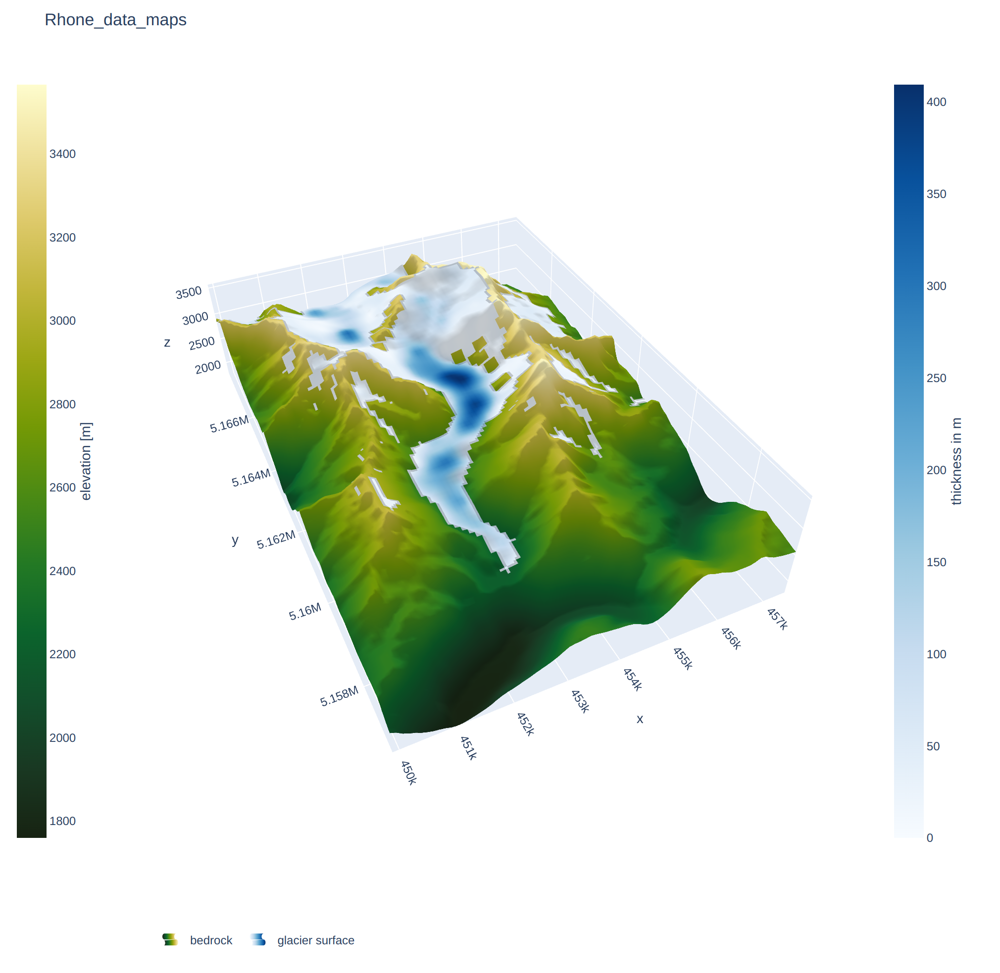
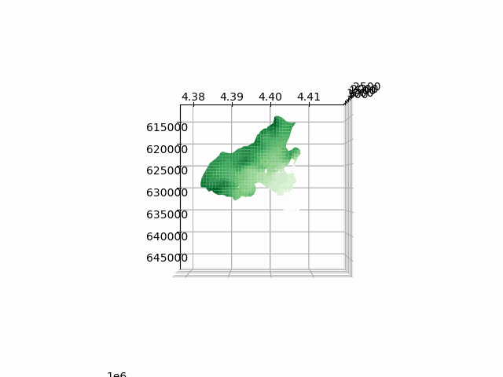

# 3D_DataVis
Python Script to create 3 dimensional interactive raster plots

:)

## create python environment in CIP pool

1. `conda init` (and restart terminal)
2. `conda create --name 3d_vis`
3. `conda activate 3d_vis`
4. `pip install matplotlib numpy rasterio Pillow plotly pandas geopandas scipy`
